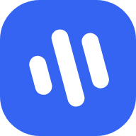
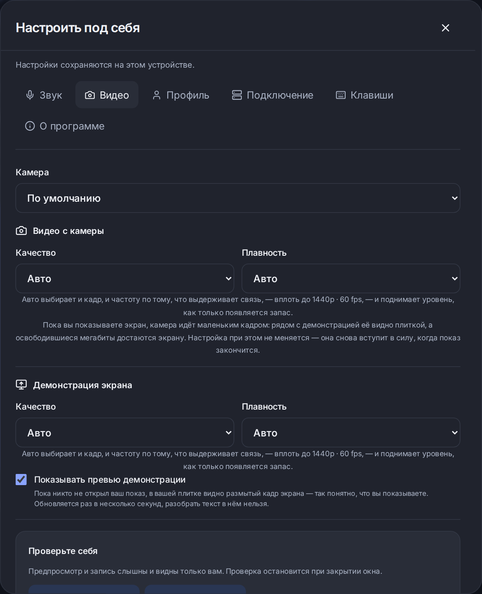

<div align="center">



# Cord для Windows

**Видеовстречи, которые можно поставить себе.**
Разговор, две демонстрации экрана до 1440p·60, чат, файлы и музыка — в приложении, которое
подключается к вашему собственному серверу.

[](https://github.com/MikkiMays/ModernStreamingSystem.Windows/releases/latest/download/Cord-Setup-x64.exe)

[](https://github.com/MikkiMays/ModernStreamingSystem.Windows/releases/latest)
[](https://github.com/MikkiMays/ModernStreamingSystem.Windows/actions/workflows/windows.yml)
[](https://github.com/MikkiMays/ModernStreamingSystem)


</div>

---

## Что это

Cord — приложение для встреч, которое не принадлежит ничьему облаку. Сервер поднимается одной
командой на любой машине с публичным адресом, и дальше он ваш: комнаты, файлы, записи в базе,
сроки хранения. Клиент для Windows — нативное окно WinUI 3 с Mica, боковой панелью и системной
темой; сам разговор идёт внутри постоянного WebView2 через тот же React-клиент, что и в
браузере. Поэтому телефон, браузер и Windows входят в одни комнаты, с одними правами и одним
чатом, а исправления интерфейса приезжают с сервера, без переустановки.

|                           |                                                                                                                             |
| ------------------------- | --------------------------------------------------------------------------------------------------------------------------- |
| **Разговор**              | до 10 участников, камера и микрофон выключены, пока их не включат; видно, кто говорит                                        |
| **Экран**                 | две демонстрации одновременно, до **1440p · 60 fps**, звук экрана стерео, закрепление и зум                                  |
| **Качество**              | «Авто» само поднимается до 1440p·60, когда канал и процессор позволяют; выбранный вручную уровень не понижается сам и действует на приём тоже |
| **Чат и файлы**           | одна лента, перетаскивание, докачка через tus, сроки хранения                                                                |
| **Музыка**                | общая очередь в комнате, стерео, Яндекс Музыка и Telegram-бот                                                                |
| **Телефон**               | тот же адрес открывается в браузере и выносится на экран «Домой» как приложение                                              |
| **Восстановление**        | обрыв сети и переключение VPN переживаются без выхода из комнаты: 20 секунд на возврат                                        |
| **Обновления**            | приложение проверяет их само и ставит без прав администратора                                                                |

<div align="center">

<br />
<sub>Кадр и частота выбираются отдельно для камеры и для экрана. Заявленное сверяется с фактическим прямо во встрече.</sub>
</div>

## Скачать

**[Cord-Setup-x64.exe](https://github.com/MikkiMays/ModernStreamingSystem.Windows/releases/latest/download/Cord-Setup-x64.exe)** —
один файл, установка для текущего пользователя, без прав администратора. Внутри уже всё:
приложение, .NET, Windows App SDK и автономный пакет WebView2 Runtime, поэтому установщик
работает и на машине без интернета. Windows 10 build 19041 и новее, x64.

Есть и переносимая
[`Cord-win-x64.zip`](https://github.com/MikkiMays/ModernStreamingSystem.Windows/releases/latest/download/Cord-win-x64.zip):
распакуйте **всю** папку и запустите `Cord.exe`. Ей нужен уже установленный WebView2 Runtime, и
она не обновляется сама.

> [!NOTE]
> Windows скажет «Система Windows защитила ваш компьютер» и назовёт издателя неизвестным:
> установщик не подписан сертификатом издателя. Нажмите **Подробнее** → **Выполнить в любом
> случае**. Это один раз, при установке. Изнутри установщика предупреждение не убирается —
> права администратора тут ни при чём. Почему так и что его убирает — в
> [installer.md](docs/installer.md#предупреждение-smartscreen-и-подпись).

## Свой сервер за одну команду

Нужна машина с публичным адресом и Docker. Имя домена желательно, но не обязательно — есть
режим с самоподписанным сертификатом прямо на IP.

```bash
git clone https://github.com/MikkiMays/ModernStreamingSystem.git
cd ModernStreamingSystem
sudo ./setup.sh --domain meet.example.com    # или: sudo ./setup.sh --ip-only
```

Скрипт спросит остальное сам, соберёт образы и поднимет ядро, SFU, TURN, базу и веб. Подробный
разбор с картинками, режимами установки и проверками — в
**[docs/INSTALL.md](https://github.com/MikkiMays/ModernStreamingSystem/blob/main/docs/INSTALL.md)**.

<details>
<summary><b>Готовое задание для ИИ-ассистента</b> — если не хочется разбираться самому</summary>

Откройте на своём сервере Claude Code, Codex или любого другого агента с доступом к терминалу
и дайте ему это целиком:

```text
Подними мне видеосервер Cord на этой машине.

1. Клонируй https://github.com/MikkiMays/ModernStreamingSystem и прочитай docs/INSTALL.md
   целиком, прежде чем что-либо запускать.
2. Выясни, есть ли у машины публичный IP и домен, который на неё указывает. Если домена нет —
   ставь в режиме --ip-only, он работает с самоподписанным сертификатом.
3. Проверь, что порты 80, 443, 3478/udp, 5349, 7881 и 7882/udp снаружи доступны, и открой их
   в файрволе, если нет. Без UDP видео пойдёт через TURN и будет хуже.
4. Запусти setup.sh с нужным режимом. Дождись, пока все контейнеры станут healthy.
5. Проверь результат: открой адрес сервера, создай встречу, убедись, что страница отдаётся по
   HTTPS и что /download открывается.
6. Скажи мне адрес сервера и что именно ты проверил. Если что-то не сошлось — скажи что
   именно, не выдавай непроверенное за работающее.

Не выполняй docker compose down -v: это удаляет тома с базой и файлами.
```

Дальше впишите адрес сервера в Cord при первом запуске — и всё.

</details>

## Сначала сервер, потом встречи

Cord открывается на экране подключения. Пока сервер не ответил, о встречах ничего не
показывается: избранное принадлежит серверу, и показывать комнаты одного сервера, будучи
подключённым к другому, было бы неправдой.

На экране — список серверов: свой, рабочий, друга. Каждый — строка с именем, **точкой
доступности** и **шестерёнкой** для изменения или удаления. Точки приложение проверяет само: оно,
в отличие от браузера, может спросить любой адрес. Сервер с включённым автоподключением
открывается сразу.

| Поле                       | Что делает                                                        |
| -------------------------- | ----------------------------------------------------------------- |
| Название сервера           | произвольная подпись для себя                                     |
| Адрес сервера              | `https://meet.example.com` или `https://203.0.113.10`             |
| Пароль                     | если сервер закрыт паролем; хранится под DPAPI, отдельно на сервер |
| Подключаться автоматически | открывать этот сервер при запуске                                 |

Отдельной проверки нет: подключение и есть проверка. Отказ оставляет внизу слева красное «Не
подключено» со стрелкой, под которой написано, что именно не так: пароль, адрес, сертификат,
сервер ещё запускается. Вписывать нужно адрес **веб-приложения**, целиком со `https://` и без
пути: клиент сам обращается к `/api/v1` и `/rtc` того же origin.

У каждого сервера свой профиль: имя, избранные комнаты, устройства и выданные разрешения
хранятся раздельно и не смешиваются при переключении. Пароль сервера шифруется средствами
Windows для вашей учётной записи и в переносимый `settings.json` не попадает. Адрес принимается
только по HTTPS — это не наше ограничение, а требование защищённого контекста: без него
браузерный движок не даст доступ к камере и микрофону.

**Настройки — одни на всё приложение.** Кнопка слева и блок профиля открывают ту же страницу,
что и шестерёнка в вебе: устройства, обработка звука, качество камеры и экрана, имя и картинка,
сервер, оформление, горячие клавиши, диагностика и «О программе» с проверкой обновлений.

**Обновления приходят с одного фиксированного адреса и не следуют за выбранным сервером:**
вход в чужую комнату не должен решать, какой исполняемый файл поставится на эту машину.
Приложение проверяет их само и показывает уведомление Windows, когда окно свёрнуто; спросить
можно и вручную. Подробности — в [updating.md](docs/updating.md).

## Из чего собрано

**Клиент:** C# 14 / .NET 10, WinUI 3 (Windows App SDK), WebView2, CommunityToolkit.Mvvm,
source-generated JSON, DPAPI. Установщик — Inno Setup, с автономным WebView2 внутри.
**Ядро:** Java 25 / Spring Boot 4, PostgreSQL 18, Redis 8, Flyway, tusd.
**Медиа:** LiveKit SFU, WebRTC, собственный TURN на 443 для сетей, где UDP закрыт.
**Веб:** React 19 с React Compiler, TypeScript, Vite 8, Base UI, LiveKit Client SDK.
**Инфраструктура:** Docker Compose, Caddy с модулем L4 для разделения HTTPS и TURN по SNI.

## Собрать из исходников

Глобальная установка .NET или Visual Studio не нужна: скрипты скачивают SDK сами, с проверкой
контрольной суммы. Из корня этого каталога, PowerShell:

```powershell
.\scripts\build.ps1                # тесты и сборка Release
.\scripts\build.ps1 -Publish       # + автономная публикация, ZIP и его SHA-256
.\scripts\build-installer.ps1      # + установщик со всеми зависимостями
.\scripts\verify-publication.ps1   # проверка ресурсов опубликованного WinUI
.\scripts\test-installer.ps1       # полный цикл установки, обновления и удаления
.\scripts\run.ps1                  # запустить опубликованное приложение
```

Для совместной разработки клонируйте оба репозитория в соседние каталоги и поднимите ядро
локально:

```powershell
git clone https://github.com/MikkiMays/ModernStreamingSystem.git
git clone https://github.com/MikkiMays/ModernStreamingSystem.Windows.git
cd ModernStreamingSystem
.\scripts\start-local.ps1 -JavaHome C:\Java\jdk-25
```

Затем укажите в настройках Cord `http://localhost:5173`. `localhost` относится только к этому
компьютеру: для телефона и других машин нужен общий HTTPS-сервер.

## Структура и данные

| Каталог                         | Ответственность                                                                      |
| ------------------------------- | ------------------------------------------------------------------------------------ |
| `src/Cord.Core`                 | Проверка server origin, HTTP-контракт избранного, типизированный bridge, канал обновлений |
| `src/Cord.Windows`              | WinUI, MVVM, WebView2, диалоги, жизненный цикл окна, DPAPI и сеть                    |
| `tests/Cord.Core.Tests`         | Origin/bridge, HTTP-контракт, разбор релиза, изоляция и постоянство профилей          |
| `scripts`                       | Сборка, публикация и проверки установки/удаления                                     |
| `installer`                     | Установщик Inno Setup, закреплённые зависимости и информация об установке             |
| `.github/workflows/windows.yml` | Сборка, тесты, артефакт и выпуск релиза                                               |

Настройки — в `%LOCALAPPDATA%\Cord\settings.json`. Секреты профилей и пароли серверов защищены
DPAPI текущего пользователя и лежат отдельными файлами; у каждого сервера свой постоянный
каталог WebView2. Тексты сообщений и содержимое вложений туда не сохраняются. Для изолированного
тестового профиля задайте `CORD_PROFILE_DIRECTORY` перед запуском.

## Что проверено, а что нет

Приёмка ведётся по журналу и не выдаёт непроверенное за работающее. Собраны и проверены:
публикация Release, установщик, полный цикл установки и удаления, загрузка ресурсов WinUI,
нативный WebView2 и мост к странице, разбор релиза и проверка контрольных сумм обновления.
Общие сценарии встреч проверяются браузерным набором соседнего проекта с настоящим SFU.

Ещё требуют стенда: разные DPI при активном звонке, смена VPN на физической машине, аппаратные
1440p60 под нагрузкой и приёмка задержек из реальных сетей. Отдельный нативный
Windows.Graphics.Capture, MSIX и подпись издателя не сделаны: захват идёт через WebView2 и общий
`CaptureAdapter`. Полный журнал —
[docs/verification.md](https://github.com/MikkiMays/ModernStreamingSystem/blob/main/docs/verification.md).

## Дальше

[Архитектура клиента](docs/architecture.md) ·
[Установщик и подпись](docs/installer.md) ·
[Как работают обновления](docs/updating.md) ·
[Заметки о выпусках](docs/releases) ·
[Ядро, веб и инфраструктура](https://github.com/MikkiMays/ModernStreamingSystem)

## Автор

Cord создаёт и развивает **[@nikgers](https://t.me/nikgers)** — пишите в Telegram по вопросам,
предложениям и сотрудничеству.
