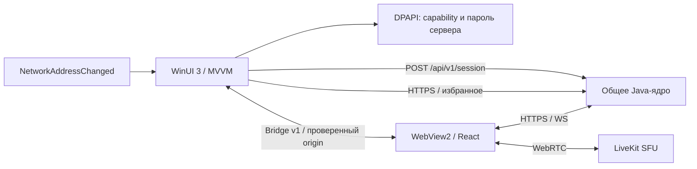

# Архитектура Windows-клиента

Приложение разделяет нативную оболочку и общий движок встречи. WinUI управляет окном и интеграцией с Windows; единственный WebView2 отображает адаптивный интерфейс и держит одну медиасессию. Переходы внутри встречи не пересоздают WebView2. Это позволяет исправлять восстановление, качество и права одновременно для веба и Windows, сохраняя границу будущего нативного захвата.

## Версии и решения

.NET SDK 10.0.400, C# 14, Windows App SDK 2.4.0, WebView2 SDK 1.0.4191.47, CommunityToolkit.Mvvm 8.4.2. Это проверенные на дату реализации версии, закреплённые вместе с транзитивными NuGet-зависимостями. Выбор WinUI опирается на [рекомендацию Microsoft для новых Windows-приложений](https://learn.microsoft.com/en-us/windows/apps/winui/winui3/), версия Windows App SDK — на [stable channel](https://learn.microsoft.com/en-us/windows/apps/windows-app-sdk/release-channels).

| Практика | Реализация |
| --- | --- |
| Разделение платформы и контрактов | `Cord.Core` не зависит от WinUI; оболочка вызывает проверенные типы и сервисы |
| MVVM и генерация кода | `ObservableObject`, partial observable properties; records DTO, source-generated System.Text.Json |
| Проверяемые границы доверия | Только HTTPS origin, HTTP разрешён лишь loopback; порт и схема входят в сравнение |
| Минимальный bridge | Версия 1, whitelist типов, проверка UUID/кода/размера; host objects выключены |
| Постоянный движок | Один WebView2 на выбранный сервер; навигация по комнате не создаёт второй reconnect loop |
| Отмена и освобождение ресурсов | CancellationToken, поколение запросов избранного, Dispose, отписка от системной сети |
| Асинхронный ввод-вывод | HttpClient с таймаутом и пулом соединений, async сохранение, DispatcherQueue для UI |
| Локальная защита профиля | DPAPI CurrentUser, отдельная энтропия и WebView2-каталог на каждый origin, атомарная запись |
| Пароль сервера | Хранится только под DPAPI, отдельным файлом на origin; в `settings.json` не попадает и странице не передаётся |
| Адаптивная оболочка | Fluent XAML, Mica, системная тема, сворачиваемая навигация, масштабирование WebView2 |
| Воспроизводимость | SDK checksum, NuGet lock files, детерминированная Release-сборка, xUnit/MTP, Windows CI |

Нативные диалоги относятся к окну и разрешениям. Медиаконтролы, предпросмотр, боковые панели звонка и экраны остаются в общем интерфейсе. [Mica](https://learn.microsoft.com/en-us/windows/apps/design/style/mica) используется как материал окна, а область видео остаётся тёмной. Начальное окно помещается в рабочую область монитора, длинная боковая панель прокручивается. Событие [ContainsFullScreenElementChanged](https://learn.microsoft.com/en-us/dotnet/api/microsoft.web.webview2.core.corewebview2.containsfullscreenelementchanged) переключает presenter окна, скрывает оболочку и восстанавливает прежний presenter после выхода из полноэкранного режима.

## Граница WebView2

При загрузке проверяется точный origin. Подготовительный скрипт только в верхнем документе этого origin передаёт capability избранного, тему и признак desktop. API файловой системы, запуска процессов или произвольный C# host object веб-странице не предоставляются. Внешние переходы внутри WebView2 блокируются; допустимая внешняя HTTP(S)-ссылка по действию пользователя открывается системным браузером. Загрузки допускаются только от настроенного сервера или принадлежащего ему blob URL. Нельзя отключать проверку сертификатов.

Подготовительный скрипт передаёт также **выданный сервером пропуск** — но никогда пароль. Пропуск кладётся в `sessionStorage` того же origin, куда положила бы его сама страница, поэтому в приложении экран подключения не показывается: рукопожатие уже сделано нативно. Значение попадает в JavaScript-литерал через двойную сериализацию, так что сервер, назвавший себя кавычкой, не может закрыть строку и продолжить кодом.

Рядом с пропуском ставится одноразовая отметка «соединение только что установлено»: подключается оболочка, а звук подключения принадлежит странице, и без отметки она бы его не издала. WebView2 при этом запускается с `--autoplay-policy=no-user-gesture-required` — в своём окне вопроса, чья это страница, нет, а иначе встреча, открытая автоподключением из избранного, начиналась бы в тишине.

Сообщения веба: `state`, `favorites.changed`, `close-ready`, `hotkey.configure`, `preferences.changed`, `call-state`, `servers.open`, `session.expired`, `server.autoconnect`. Сообщения оболочки: `navigate`, `network.changed`, `theme.changed`, `close-request`, `profile.changed`, `hotkey.status`, `microphone.toggle`, `favorite.settings`, `session.token`, `settings.open`; все имеют версию 1. Последнее открывает настройки страницы на нужном разделе — и кнопка настроек, и блок профиля ведут туда же: настройки принадлежат странице целиком, вместе с именем, картинкой, устройствами, звуком, качеством, клавишами и оформлением. Своего диалога настроек у оболочки больше нет; свой у неё только список серверов, которого странице иметь нельзя. `state` несёт картинку профиля (маленький `data:`-URI, до 4 КиБ) — блок профиля показывает её, но не владеет ею. `server.autoconnect` идёт в обратную сторону: переключатель автоподключения стоит на странице, а решение, открывать ли сервер без вопросов, принимает приложение. JSON ограничен по длине и валидируется перед использованием. Нативный HTTP-клиент не следует redirect с credential на другой адрес. Практики соответствуют [модели безопасности WebView2](https://learn.microsoft.com/en-us/microsoft-edge/webview2/concepts/security).

Разрешения ограничены камерой и микрофоном выбранного сервера. WinUI показывает понятный диалог; положительное решение сохраняется в профиле WebView2, «Не сейчас» не записывает постоянный запрет. Кнопки сброса в приложении нет — разрешение снимается вместе с каталогом сервера в `%LOCALAPPDATA%\Cord\WebView2`; [CoreWebView2Profile.SetPermissionStateAsync](https://learn.microsoft.com/en-us/microsoft-edge/webview2/reference/winrt/microsoft_web_webview2_core/corewebview2profile) сделал бы это изнутри, но пока не используется. Системный выбор экрана остаётся под контролем браузера/Windows и пользователя.

## Подключение к серверу

Сначала сервер, потом встречи. На старте оболочка берёт сохранённый адрес, читает пароль из DPAPI и выполняет рукопожатие; WebView2 открывается только после успеха. Если автоподключение выключено или рукопожатие не прошло, показывается нативный экран серверов: список с синим плюсом, шестерёнкой у каждой строки, полем пароля, кнопкой «Подключиться» и отдельной маленькой проверкой. Отказ объясняется по существу — пароль, адрес, сертификат, ещё не поднявшийся сервер, — потому что «не удалось» отправляет чинить то, что не ломалось.

Браузер так не умеет: ядро отклоняет чужой `Origin`, поэтому страница может обратиться только к тому серверу, который её отдал. Из-за этого список серверов, пароль и рукопожатие живут в оболочке, а странице достаётся готовый результат. Экран подключения в WebView2 остаётся только как запасной путь и умеет попросить оболочку открыть её список (`servers.open`).

Истёкший пропуск чинится оболочкой по сообщению `session.expired` и возвращается через `session.token`. Встречу это не прерывает, и пароль по-прежнему не покидает DPAPI.

Один диалог за раз: WinUI не покажет второй поверх первого. Поэтому шестерёнка и плюс закрывают список и открывают редактор, а переход на другой сервер выполняется **после** закрытия диалога — иначе подтверждение выхода из встречи ждало бы диалог, который ждёт его. Записанный сервер возвращается уже выбранным: искать его в списке после того, как только что вписал, незачем.

Точки доступности рядом с именами проверяет сам клиент — он, в отличие от страницы, может спросить любой адрес. Отдельной кнопки проверки нет: подключение и есть проверка, а окно, закрывшееся по проверке, сказало бы «готово» про то, чего не делало.

**Темовые кисти нельзя брать из `Application.Current.Resources`.** Такой поиск разрешает словари по теме *приложения*, а диалоги рисуются с той темой, которую выбрали внутри Cord. Когда они расходятся, возвращается светлая кисть для тёмного окна — чёрный текст на чёрном. Вторичный текст поэтому приглушается прозрачностью: она наследует тот цвет, который у дерева элементов действительно есть, и спорить ей не с чем.

## Жизненный цикл и сеть

На старте загружаются настройки, выполняется рукопожатие с сервером, создаётся изолированное окружение WebView2, затем открывается сервер. Смена сервера во время звонка требует явного выхода; процесс медиа не переносится между разными origin. После сбоя WebView2 оболочка показывает возможность открыть пространство заново вместо молчаливого автоматического входа.

`NetworkAddressChanged` объединяется с задержкой 500 мс и отправляет сигнал общему MediaSession. Доступность сервера проверяется самим соединением. Фиксированный 20-секундный срок не обнуляется при повторных сетевых уведомлениях. Закрытие окна в звонке ждёт подтверждения выхода максимум 2,5 секунды, затем освобождает окно; серверная очистка покрывает незавершённый сетевой запрос.

Синхронизация голоса, камеры и звука демонстрации принадлежит WebRTC. Общий клиент наблюдает буфер/декодирование и умеет обновлять связанные подписки для возвращения к эфиру. Нативная оболочка не меняет скорость аудио или шкалу времени видео. Частота 60 fps и выбор 1440p остаются запросом к реальному устройству; измеренные FPS/битрейт доступны в диагностике.

## Развитие

Прямой LAN-канал требует отдельного согласования через ядро, проверки устройства, аппаратного кодирования, синхронизации аудио/видео и безопасного возврата к SFU при смене сети. Текущий клиент использует LiveKit SFU; наличие Bluetooth не включает другой медиатранспорт. [Разбор архитектуры и 14 открытых проектов](https://github.com/MikkiMays/ModernStreamingSystem/blob/main/docs/latency-and-network.md) фиксирует границы будущего эксперимента.

Распространение выполняется установщиком Inno Setup поверх self-contained публикации. PRI/XBF копируются явно после Publish, затем CLI-проверка загружает настоящий MainWindow без активации окна. Установщик сохраняет профиль вне своей папки и не удаляет общий WebView2. [Сборка, обновление и проверка установки](installer.md).

Следующий нативный адаптер может реализовать `CaptureAdapter` через Windows.Graphics.Capture и передать совместимые дорожки в согласованный медиадвижок. Одного захвата кадров недостаточно: отдельно потребуются аппаратное кодирование, передача в WebRTC, часы аудио/видео и тесты смены источника. Эта часть сейчас не подменена имитацией. C#-контракты можно расширить генерацией из OpenAPI при переносе других обязанностей из общего клиента; серверные правила при этом остаются едиными.
